<!-- Terminal Profile Header -->
<h3><code>aiyzoxx@github ~ $ whoami</code></h3>

<table>
  <tr>
    <td valign="top"></td>
    <td valign="top"></td>
  </tr>
</table>

 
 

<!-- Animated GitHub Contributions Heatmap -->
<h3><code>aiyzoxx@github ~ $ ./contributions.sh</code></h3>

 
 

