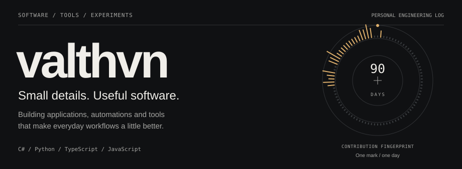
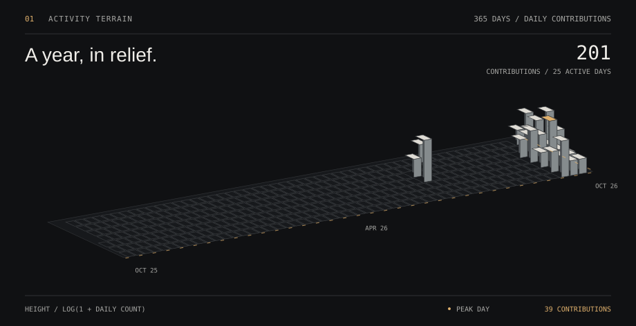
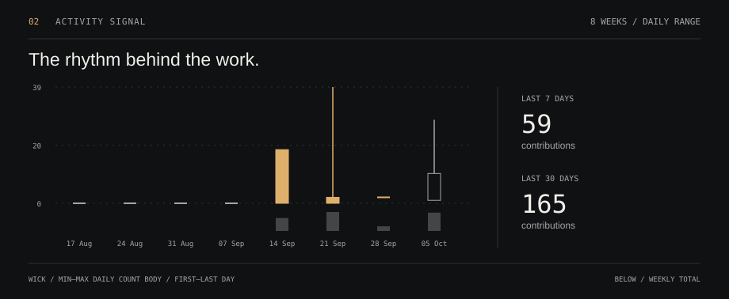
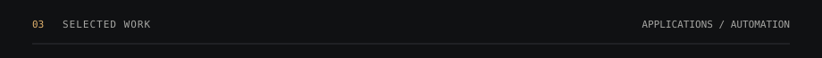
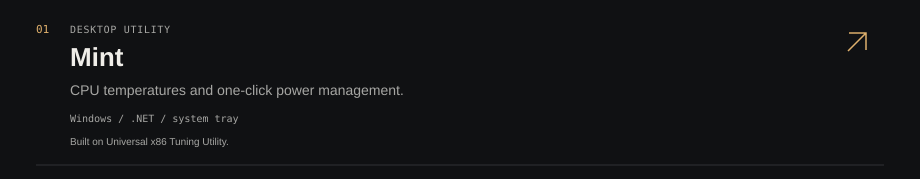
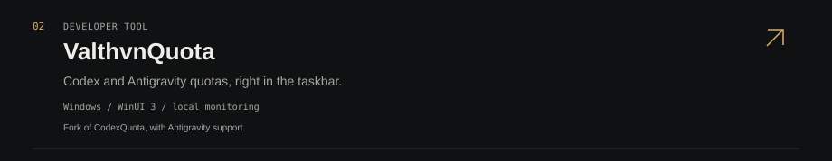
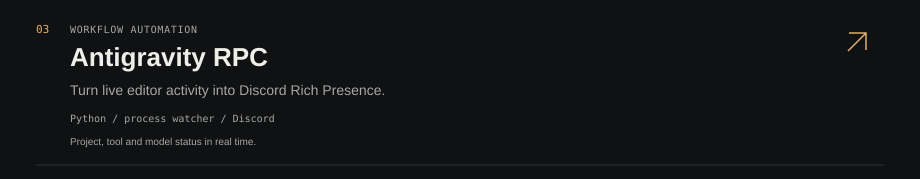
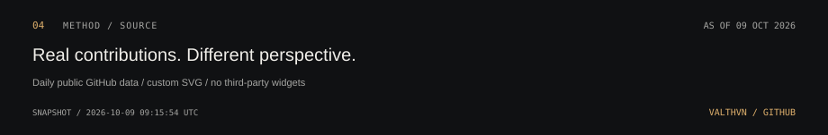

<!-- Generated by scripts/render_observatory.py. Edit data/observatory.json for copy and projects. -->

<picture>
  <source media="(prefers-color-scheme: dark)" srcset="./assets/hero-dark.svg">
  <source media="(prefers-color-scheme: light)" srcset="./assets/hero-light.svg">
  
</picture>

<picture>
  <source media="(prefers-color-scheme: dark)" srcset="./assets/terrain-dark.svg">
  <source media="(prefers-color-scheme: light)" srcset="./assets/terrain-light.svg">
  
</picture>

<picture>
  <source media="(prefers-color-scheme: dark)" srcset="./assets/signal-dark.svg">
  <source media="(prefers-color-scheme: light)" srcset="./assets/signal-light.svg">
  
</picture>

<picture>
  <source media="(prefers-color-scheme: dark)" srcset="./assets/work-dark.svg">
  <source media="(prefers-color-scheme: light)" srcset="./assets/work-light.svg">
  
</picture>

<a href="https://github.com/valthvn/Mint">
<picture>
  <source media="(prefers-color-scheme: dark)" srcset="./assets/project-1-dark.svg">
  <source media="(prefers-color-scheme: light)" srcset="./assets/project-1-light.svg">
  
</picture>
</a>

<a href="https://github.com/valthvn/ValthvnQuota">
<picture>
  <source media="(prefers-color-scheme: dark)" srcset="./assets/project-2-dark.svg">
  <source media="(prefers-color-scheme: light)" srcset="./assets/project-2-light.svg">
  
</picture>
</a>

<a href="https://github.com/valthvn/antigravity-discord-rpc">
<picture>
  <source media="(prefers-color-scheme: dark)" srcset="./assets/project-3-dark.svg">
  <source media="(prefers-color-scheme: light)" srcset="./assets/project-3-light.svg">
  
</picture>
</a>

<picture>
  <source media="(prefers-color-scheme: dark)" srcset="./assets/footer-dark.svg">
  <source media="(prefers-color-scheme: light)" srcset="./assets/footer-light.svg">
  
</picture>

  <a href="https://github.com/valthvn?tab=repositories">All repositories</a> · <a href="https://github.com/valthvn/valthvn">Source</a> · <a href="./docs/observatory.md">How this profile works</a>

