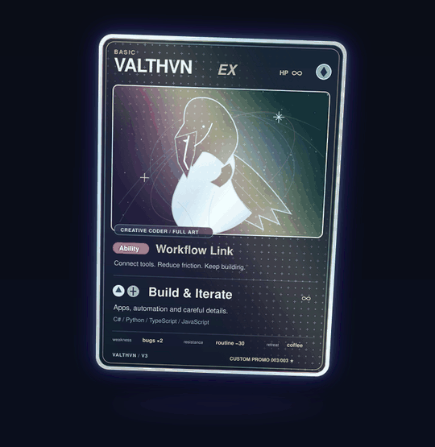
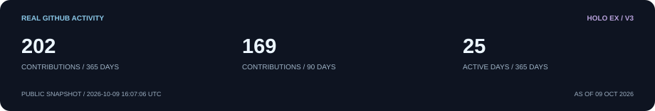

<!-- HOLO EX / V3 — profile animation and daily public data -->

<picture>
  <source media="(prefers-reduced-motion: reduce)" srcset="./assets/holo/profile-still.png">
  <source type="image/webp" srcset="./assets/holo/profile.webp">
  
</picture>

  <a href="https://github.com/valthvn?tab=repositories">All repositories</a> · <a href="./docs/holo.md">How the holo works</a> · <a href="./docs/versions.md">Saved versions: v1 / v2 / v3</a>

