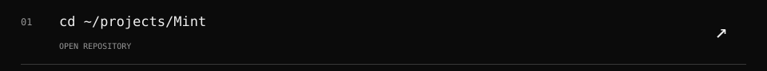
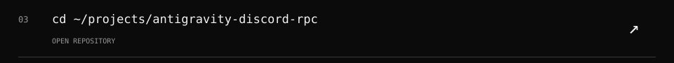

<!-- VALTHVN / SESSION 005 -->



<a href="https://github.com/valthvn/Mint"></a><br>
<a href="https://github.com/valthvn/ValthvnQuota"></a><br>
<a href="https://github.com/valthvn/antigravity-discord-rpc"></a><br>

<details>
<summary><code>~ $ cat stack.json</code></summary>

```json
{
  "languages": ["Python", "TypeScript", "JavaScript"],
  "frontend": ["React", "Next.js", "Tailwind CSS"],
  "backend": ["FastAPI", "Node.js", "Express"],
  "tools": ["Docker", "Git", "Linux", "GitHub Actions"]
}
```

</details>

<br>



<details>
<summary><code>~ $ help</code></summary>

`projects/` — click a repository row above.  
`stack.json` — expand the toolbox.  
`activity.log` — real public contribution candles, refreshed daily.

</details>
