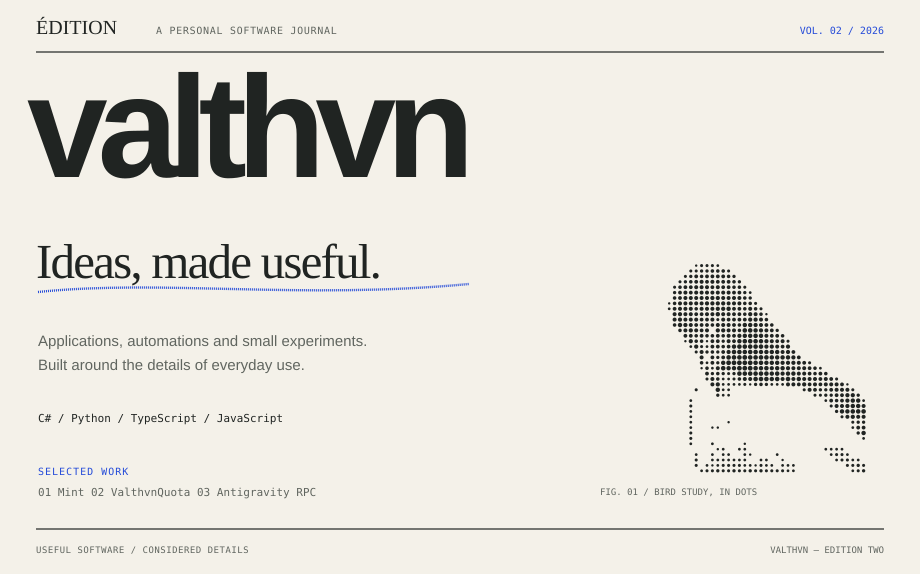
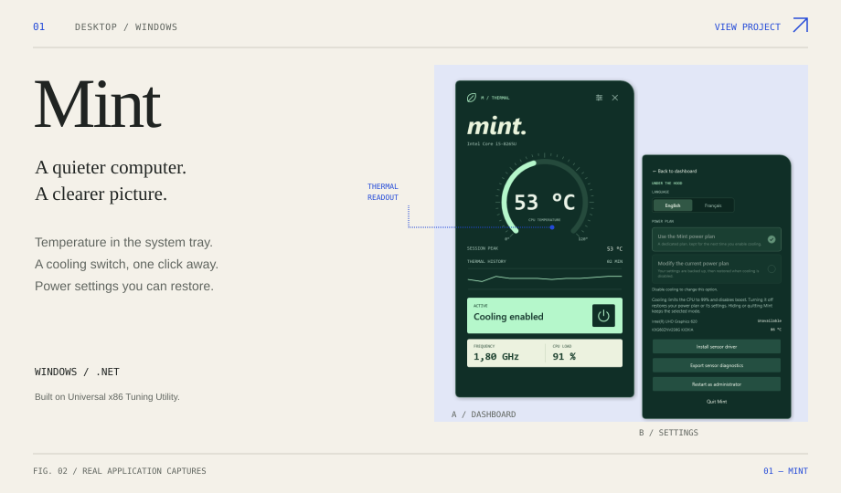
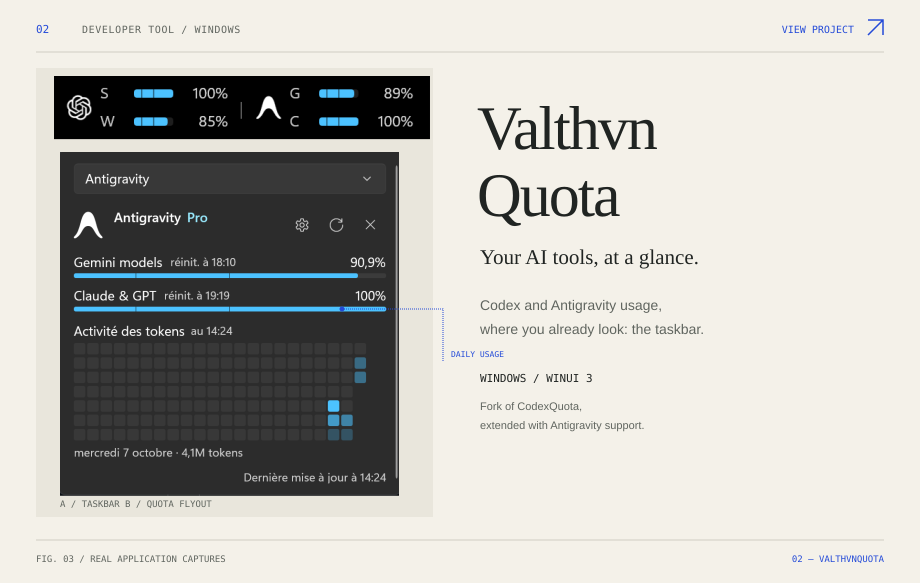
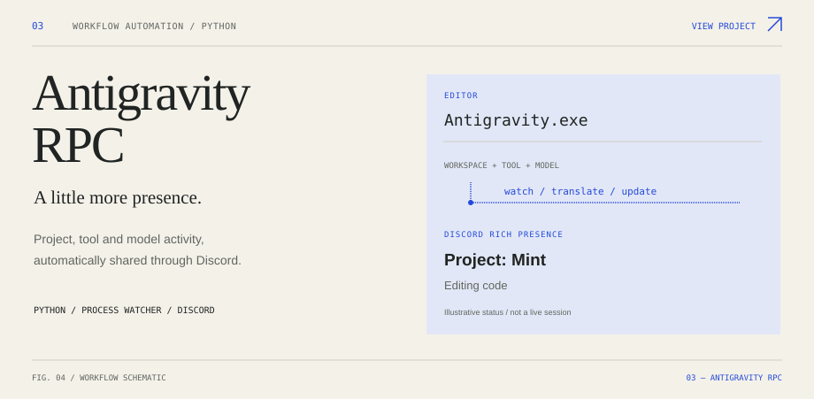
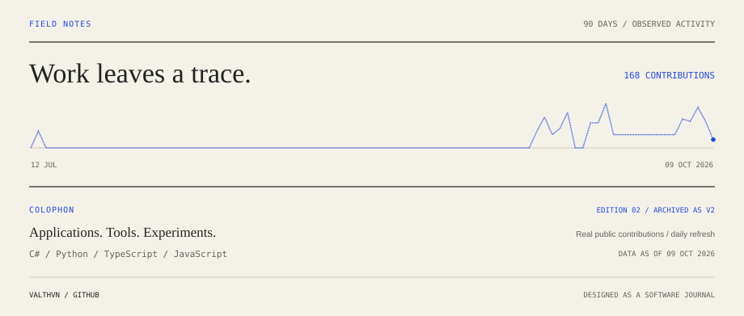

<!-- ÉDITION / V2 — generated by scripts/render_edition.py -->

  <a href="https://github.com/valthvn?tab=repositories">All work</a> · <a href="./docs/edition.md">Colophon &amp; sources</a> · <a href="./docs/versions.md">Back issues: v1 / v2</a>

