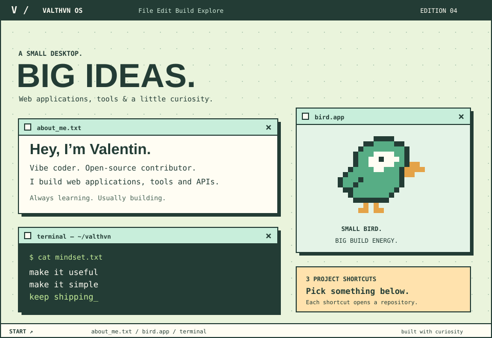
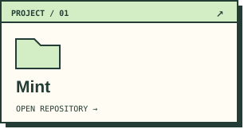
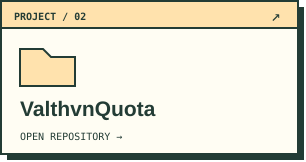
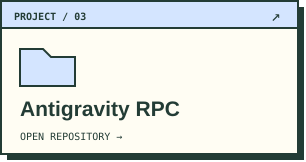

<!-- VALTHVN OS / V4 — original desktop edition -->

### My toolbox

**Languages** · Python / TypeScript / JavaScript  
**Interfaces** · React / Next.js / Tailwind CSS  
**Behind the scenes** · FastAPI / Node.js / Express  
**Everyday tools** · Docker / Git / Linux / GitHub Actions

 

  <a href="https://github.com/valthvn?tab=repositories">Explore all repositories ↗</a>
  &nbsp; · &nbsp;
  <a href="./docs/versions.md">Change the wallpaper: v1 / v2 / v3 / v4</a>

